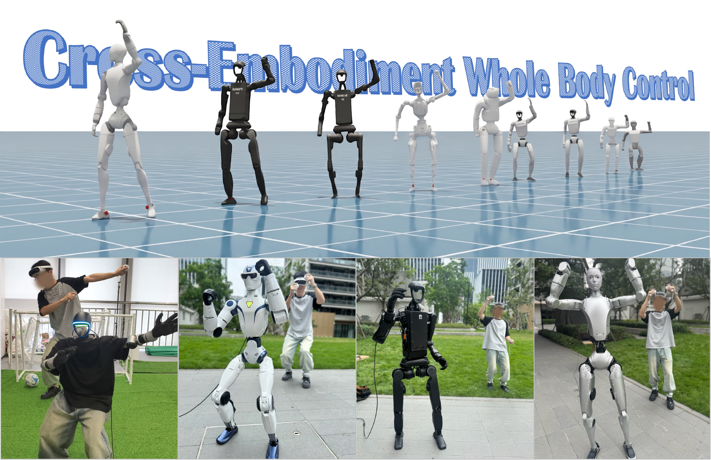

<h1 align="center">X-WBC: A Cross-Embodiment Foundation Model for Humanoid Whole-Body Control</h1>

<div align="center">

**CoRL 2026**

[Project Page](https://logosroboticsgroup.github.io/x-wbc/) ·
[Paper](https://arxiv.org/abs/2609.15213) ·
[Repository](https://github.com/LogosRoboticsGroup/x-wbc)

</div>



> **Release status:** This repository currently hosts the official project page
> and release announcement for X-WBC. The implementation, checkpoints, and
> training assets are still being prepared for public release. Star or watch the
> repository to follow future updates.

## Overview

X-WBC studies how humanoid whole-body control experience can be shared across
robots with different morphologies, joint layouts, dynamics, and action spaces.
It combines a shared temporal motion backbone with lightweight
embodiment-specific modules, allowing multiple humanoids to contribute to one
joint training process while retaining robot-specific execution.

The framework supports three human-centered command routes—full human motion,
retargeted robot motion, and sparse five-point VR observations—and is evaluated
across nine simulated humanoid embodiments. We additionally demonstrate the
same sparse-VR interaction format on four physical humanoid platforms.

## Highlights

- One shared motion Transformer trained with mixed multi-robot rollouts.
- Robot-specific state encoders and action decoders for heterogeneous bodies.
- Unified command tokens for human motion, robot references, and sparse VR.
- Evaluation on nine simulated embodiments and deployment on four real robots.
- Separate training-distribution studies and frozen external-style evaluation.

## Planned Release

- [x] Project page and demo video.
- [x] Official paper link.
- [ ] Training and evaluation code.
- [ ] Checkpoints and deployment examples.

Code and model weights are being prepared for release.

## Citation

If you find X-WBC useful, please cite:

```bibtex
@inproceedings{zhang2026xwbc,
  title     = {X-WBC: A Cross-Embodiment Foundation Model
               for Humanoid Whole-Body Control},
  author    = {Zhang, Juntong and Gu, Chun and Zhang, Li},
  booktitle = {Conference on Robot Learning},
  year      = {2026}
}
```

## Institutions

Tongji University · Fudan University · Shanghai Innovation Institute

## License

The license for the future code and model release has not yet been finalized.
Unless stated otherwise, no license is granted for unreleased implementation or
model artifacts.

## Acknowledgements

We thank the authors and maintainers of the humanoid-learning community whose
open research has made reproducible whole-body control possible. Detailed
third-party acknowledgements and inherited licenses will accompany the code
release.
